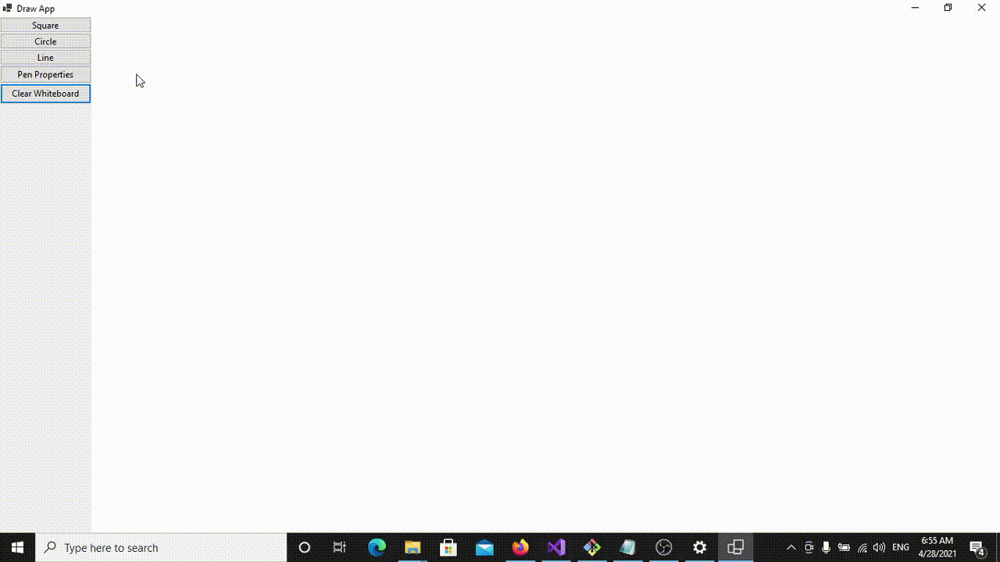

# Draw App
> Taking baby steps to be the next Illustrator...

An application for drawing simple shapes.

## Demo

## Key Features

* Drawing shapes like circles, rectangles and lines
* Changing shapes colors
* Changing shapes sizes
* Changing shape's line style
* Selecting shapes
* Resizing shapes
* Clearing the whiteboard

## Coming Next

* Select multi-shapes at once
* Moving shapes
* Lebel current options
* Create custom extension for profiling
* Export as image

## Group Members

- [Abdulaziz Alasmari](https://github.com/Abdulaziz-Alasmari) [Leader]
- [Abdulrahman Aljafar](https://github.com/AbdulrahmanAljafar)
- [Fahad AlKhayyal](https://github.com/fahad-safcsp)
- [Ahmed Almutairi](https://github.com/Ahmed-Almutairi)
- [Hassan Algadah](https://github.com/hassanalgadah-tuwaiq)